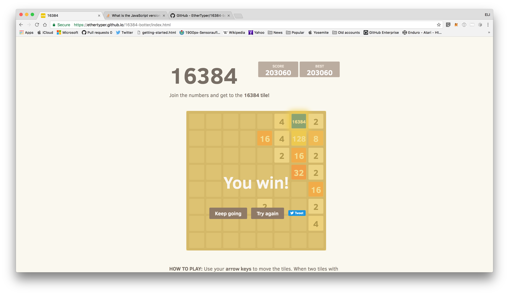

# 16384 HAXXED EDITION

Play: [2048](http://gabrielecirulli.github.io/2048/) | [16384](http://annimon.github.io/16384/)

A small clone of [1024](https://play.google.com/store/apps/details?id=com.veewo.a1024), based on [Saming's 2048](http://saming.fr/p/2048/) (also a clone) BUT IT'S HAXXED.

Made just for <s>fun</s> HAXXING.

### Contributions

 - [TimPetricola](https://github.com/TimPetricola) added best score storage
 - [chrisprice](https://github.com/chrisprice) added custom code for swipe handling on mobile
 - [EtherTyper](https://github.com/EtherTyper) ADDED HAXXING AND B0TTING!

Many thanks to [rayhaanj](https://github.com/rayhaanj), [Mechazawa](https://github.com/Mechazawa), [grant](https://github.com/grant), [remram44](https://github.com/remram44) and [ghoullier](https://github.com/ghoullier) for the many other good contributions.

### Screenshot

That screenshot is <s>fake, by the way. I never reached 2048 :smile:</s> HAXXED BY A B0TTER!!

## Contributing
Changes and improvements are more than welcome! Feel free to fork and open a pull request. Please make your changes in a specific branch and request to pull into `master`! If you can, please make sure the game fully works before sending the PR, as that will help speed up the process.

You can find the same information in the [contributing guide.](https://github.com/gabrielecirulli/2048/blob/master/CONTRIBUTING.md)

## License
<s>2048</s> 16384 HAXXED EDITION is licensed under the [MIT license.](https://github.com/gabrielecirulli/2048/blob/master/LICENSE.txt)

## Donations
I made this in my spare time, and it's hosted on GitHub (which means I don't have any hosting costs), but if you enjoyed the game and feel like buying Gabriel Cirulli coffee, you can donate at his BTC address: `1Ec6onfsQmoP9kkL3zkpB6c5sA4PVcXU2i`. Thank you very much!
